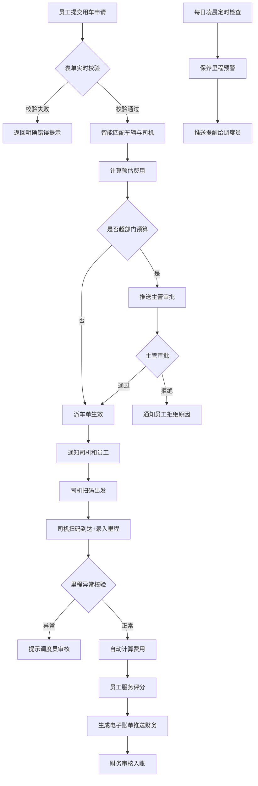

## 1. 产品概述

企业内部公务车辆与司机调度平台，解决企业公务用车调度效率低、成本难管控、服务质量无追溯等问题。支持员工、主管、司机、调度员、财务五种角色协同，实现从用车申请、智能派车、行程执行、费用结算到保养维护的全流程数字化管理。

目标价值：将派车效率提升60%，预算超支率降低80%，车辆使用率提高40%，服务满意度提升至95%以上。

## 2. 核心功能

### 2.1 用户角色

| 角色 | 注册方式 | 核心权限 |
|------|----------|----------|
| 员工 | 管理员导入/企业账号同步 | 提交用车申请、查看派车状态、扫码确认、服务评分、查看个人账单 |
| 主管 | 管理员分配 | 审批超预算申请、查看部门用车统计、管理部门预算 |
| 司机 | 管理员注册 | 查看派车任务、扫码出发/到达、记录里程、查看个人排班 |
| 调度员 | 管理员注册 | 车辆管理、司机管理、排班管理、派车干预、保养提醒处理 |
| 财务 | 管理员注册 | 账单审核、费用统计、预算配置、发票管理、财务报表导出 |

### 2.2 功能模块

1. **登录认证页**：角色选择登录、权限校验、会话管理
2. **员工工作台**：用车申请、我的申请、行程详情、服务评分
3. **主管工作台**：待审批列表、部门统计、预算管理
4. **司机工作台**：今日任务、扫码执行、行程记录、个人排班
5. **调度员工作台**：车辆管理、司机管理、智能派车、排班管理、保养提醒
6. **财务工作台**：账单管理、费用统计、预算配置、报表导出
7. **系统通知中心**：审批通知、派车通知、保养提醒、账单通知

### 2.3 页面详情

| 页面名称 | 模块名称 | 功能描述 |
|----------|----------|----------|
| 登录页 | 角色选择 | 5种角色Tab切换，账号密码登录，表单校验 |
| 登录页 | 安全提示 | 密码强度提示、验证码、登录错误明确提示 |
| 员工工作台 | 用车申请表单 | 起始地/目的地、用车时间、人数、车型偏好、事由、实时校验时间冲突 |
| 员工工作台 | 申请列表 | 待派车/已派车/进行中/已完成/已拒绝状态分类筛选 |
| 员工工作台 | 行程详情 | 车辆信息、司机信息、实时状态、里程、时长、费用明细 |
| 员工工作台 | 服务评分 | 1-5星评分、多维度评价（准时、安全、服务、车况）、文字评价 |
| 主管工作台 | 审批列表 | 超预算申请展示、费用对比、一键通过/拒绝、审批意见 |
| 主管工作台 | 部门统计 | 月度用车次数、费用趋势图、各员工用车排行 |
| 主管工作台 | 预算管理 | 设置部门月度预算、查看预算使用率、预警阈值配置 |
| 司机工作台 | 今日任务 | 时间轴展示、任务状态标识、一键联系乘客 |
| 司机工作台 | 扫码执行 | 二维码扫描出发/到达、手动输入里程/自动计算、异常里程校验 |
| 司机工作台 | 排班日历 | 月视图排班、出车/休息/请假状态 |
| 调度员工作台 | 车辆管理 | 车辆增删改查、状态（空闲/出车/维修/保养）、里程记录、保险年检提醒 |
| 调度员工作台 | 司机管理 | 司机档案、驾照信息、服务评分、排班状态 |
| 调度员工作台 | 智能派车 | 自动匹配结果展示、手动调整、分配确认、冲突检测 |
| 调度员工作台 | 保养提醒 | 到期保养车辆列表、保养记录登记、下次保养里程自动计算 |
| 财务工作台 | 账单列表 | 电子账单、审核状态、按部门/时间筛选 |
| 财务工作台 | 费用统计 | 多维度图表（按车型/部门/月份）、趋势分析 |
| 财务工作台 | 报表导出 | Excel/PDF导出、自定义时间范围 |

## 3. 核心流程

### 主流程：用车申请到费用结算

员工登录系统，填写用车申请表单（起始地、目的地、时间、人数、车型偏好），系统实时校验时间冲突与格式错误。提交后，系统执行智能匹配算法：根据车辆状态（空闲）、司机排班（可用）、车型匹配度、距离优先级计算最优组合，生成派车单。同时计算预估费用，若超出部门剩余预算，自动发送审批通知给主管；主管在审批页通过或拒绝，通过后派车单生效，否则通知员工。派车成功后，司机和员工均收到通知。司机到达后扫码确认出发，系统记录出发时间；到达目的地后扫码确认到达，司机录入里程（系统校验里程合理性），自动计算时长与费用。员工完成行程后可对司机服务进行多维度评分。系统按车型单价和里程自动生成电子账单，推送至财务工作台，财务审核后入账。每日凌晨定时任务检查所有车辆里程，接近保养阈值的推送提醒给调度员。

## 4. 用户界面设计

### 4.1 设计风格

**整体风格：专业企业级 · 深蓝科技感**

- **主色调**：深空蓝 `#1e3a5f`（信任、专业、稳重）
- **辅助色**：科技青 `#00bcd4`（活力、创新）、警示橙 `#ff9800`（提醒）、成功绿 `#4caf50`、错误红 `#f44336`
- **背景色**：浅灰蓝 `#f0f4f8`（页面背景）、纯白 `#ffffff`（卡片背景）
- **字体**：标题使用 Noto Sans SC Bold / 思源黑体 Bold，正文使用 Noto Sans SC Regular / 思源黑体 Regular，数字使用 JetBrains Mono
- **按钮风格**：圆角 8px，主按钮深蓝渐变+轻微阴影，悬停有微妙上浮动画
- **卡片风格**：圆角 12px，柔和阴影（box-shadow: 0 4px 20px rgba(30,58,95,0.08)），悬停阴影加深
- **布局风格**：左侧固定导航栏（深蓝背景+白色图标文字）+ 顶部状态栏 + 右侧主内容区（卡片网格）
- **图标风格**：Material Design Icons，线性风格，统一 24px 尺寸

### 4.2 页面设计概述

| 页面名称 | 模块名称 | UI元素风格 |
|----------|----------|------------|
| 登录页 | 登录卡片 | 居中卡片、深蓝渐变左侧装饰条、浮动动画输入框、角色选择Tab胶囊 |
| 员工工作台 | 申请卡片 | 状态色标（待派车蓝/进行中青/已完成绿）、进度条、行程信息分组展示 |
| 主管工作台 | 审批卡片 | 超预算红色高亮、费用对比进度环、审批按钮左右布局 |
| 司机工作台 | 任务时间轴 | 左侧竖线+圆点状态色、卡片悬浮、大字体时间显示 |
| 调度员工作台 | 车辆列表 | 表格+卡片双视图切换、状态指示灯、里程进度条（接近保养变黄/红） |
| 财务工作台 | 统计看板 | 大数字KPI卡片、彩色面积图、圆环图占比、筛选器栏 |

### 4.3 响应式设计

- **桌面优先**：最低支持 1366×768 分辨率，最佳 1920×1080 及以上
- **平板适配**：1024px 断点，侧边栏折叠为图标模式
- **移动端**：768px 断点，侧边栏转为底部Tab导航，卡片转为单列，表格支持横滑
- **触控优化**：按钮最小点击区域 44×44px，表单输入框高度 48px

### 4.4 动效设计

- **页面加载**：顶部进度条 + 卡片依次淡入上浮（staggered animation，间隔 80ms）
- **侧边导航**：当前项左侧蓝色高亮条平滑滑动
- **状态切换**：圆形状态指示器呼吸灯效果
- **按钮交互**：点击时轻微缩小（scale 0.96）+ 涟漪扩散效果
- **通知提醒**：右上角滑入动画 + 轻微震动（移动端）
- **数据加载**：骨架屏渐变闪烁占位
