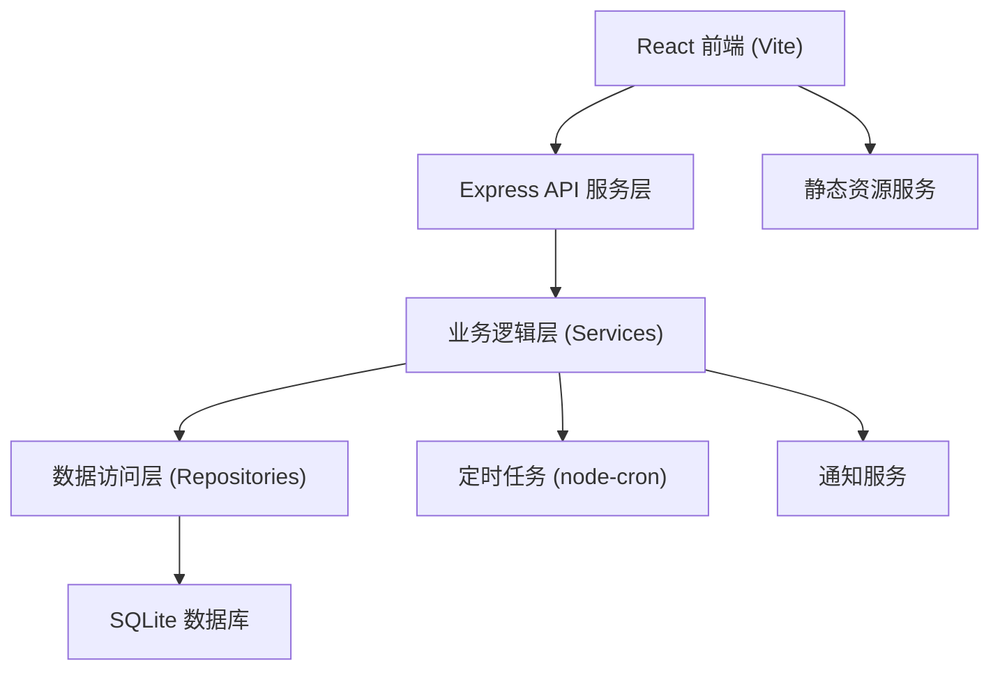
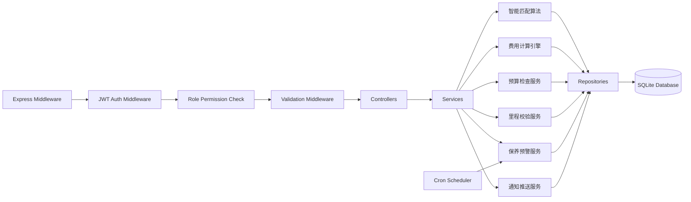

## 1. 架构设计



## 2. 技术说明

- **前端**：React@18 + TypeScript + Tailwind CSS@3 + React Router@6 + Axios + Recharts 图表库 + Vite@5
- **初始化工具**：Vite (react-ts 模板)
- **后端**：Node.js + Express@4 + TypeScript + JWT 认证
- **数据库**：SQLite3 (better-sqlite3，零配置便于部署)
- **ORM**：无原生ORM，手写Repository层保证性能与可控性
- **定时任务**：node-cron (每日凌晨保养检查)
- **状态管理**：React Context + useReducer (轻量级，避免redux复杂性)
- **API文档**：Swagger/OpenAPI注释
- **构建工具**：concurrently (前后端同时启动)

## 3. 路由定义

| 路由 | 用途 |
|------|------|
| /login | 登录认证页（角色选择） |
| /employee/dashboard | 员工工作台首页（申请列表概览） |
| /employee/apply | 新建用车申请 |
| /employee/applications | 我的申请列表 |
| /employee/application/:id | 申请/行程详情 |
| /employee/rating/:tripId | 服务评分页 |
| /supervisor/dashboard | 主管工作台首页（待办+统计） |
| /supervisor/approvals | 待审批列表 |
| /supervisor/statistics | 部门用车统计 |
| /supervisor/budget | 部门预算管理 |
| /driver/dashboard | 司机工作台首页（今日任务） |
| /driver/scan | 扫码执行（出发/到达） |
| /driver/trips | 历史行程记录 |
| /driver/schedule | 排班日历 |
| /dispatcher/dashboard | 调度员工作台首页（总览） |
| /dispatcher/vehicles | 车辆管理 |
| /dispatcher/drivers | 司机管理 |
| /dispatcher/dispatch | 派车中心（智能匹配+手动调整） |
| /dispatcher/maintenance | 保养提醒与记录 |
| /finance/dashboard | 财务工作台首页（统计概览） |
| /finance/bills | 账单管理与审核 |
| /finance/statistics | 多维度费用统计 |
| /finance/reports | 报表导出 |
| /notifications | 通知中心（全局） |

## 4. API 定义

```typescript
// ============ 认证模块 ============
POST /api/auth/login
Request: { username: string, password: string, role: 'employee'|'supervisor'|'driver'|'dispatcher'|'finance' }
Response: { token: string, user: User, rolePermissions: string[] }
错误: 401 { code: 'INVALID_CREDENTIALS', message: '账号或密码错误' }
     403 { code: 'ROLE_MISMATCH', message: '该账号无此角色权限' }

// ============ 用户模块 ============
GET /api/users/profile
Response: User

// ============ 用车申请模块 ============
POST /api/applications
Request: {
  origin: string, destination: string,
  startTime: ISOString, endTime: ISOString,
  passengers: number, carTypePreference: 'sedan'|'suv'|'van'|'business',
  reason: string
}
校验: startTime必须晚于当前时间、endTime必须晚于startTime、passengers>=1
错误: 400 { code: 'TIME_CONFLICT', message: '该时段您已有其他用车申请，请调整时间' }
     400 { code: 'INVALID_TIME_RANGE', message: '用车时间不合法，请检查' }

GET /api/applications?status=pending|dispatched|in_progress|completed|rejected&page=1&size=10
Response: { list: Application[], total: number }

GET /api/applications/:id
Response: Application & { vehicle?: Vehicle, driver?: Driver, trip?: Trip }

// ============ 审批模块 ============
GET /api/approvals?status=pending|approved|rejected
Response: ApprovalListItem[]

POST /api/approvals/:id/decision
Request: { approved: boolean, comment?: string }
错误: 409 { code: 'ALREADY_PROCESSED', message: '该申请已被处理' }

// ============ 派车模块 ============
GET /api/dispatch/pending-applications
Response: PendingApplication[] (含智能匹配推荐)

POST /api/dispatch/assign/:applicationId
Request: { vehicleId: number, driverId: number, overrideConflict?: boolean }
错误: 409 { code: 'VEHICLE_BUSY', message: '该车辆在申请时段已被占用' }
     409 { code: 'DRIVER_BUSY', message: '该司机在申请时段已有排班' }

GET /api/dispatch/suggest/:applicationId
Response: {
  vehicles: { vehicle: Vehicle, score: number, reason: string }[],
  drivers: { driver: Driver, score: number, reason: string }[]
}

// ============ 司机任务模块 ============
GET /api/driver/tasks/today
Response: DriverTask[]

POST /api/driver/trips/:tripId/depart
Request: { qrCode: string } 或模拟扫码 { odometerStart: number }
错误: 400 { code: 'TRIP_NOT_READY', message: '当前任务不可出发，请确认时间' }

POST /api/driver/trips/:tripId/arrive
Request: { odometerEnd: number }
校验: odometerEnd必须>odometerStart、里程合理性(时间/距离匹配)
错误: 400 { code: 'MILEAGE_TOO_LOW', message: '结束里程必须大于起始里程' }
     400 { code: 'MILEAGE_ABNORMAL', message: '里程与时间比例异常，请确认或联系调度员' }

// ============ 评分模块 ============
POST /api/ratings
Request: {
  tripId: number, punctuality: 1-5, safety: 1-5, service: 1-5,
  vehicleCondition: 1-5, comment?: string
}
错误: 409 { code: 'ALREADY_RATED', message: '该行程已评分' }

// ============ 车辆管理模块 ============
GET /api/vehicles?status=idle|in_use|maintenance|repair
Response: Vehicle[]

POST /api/vehicles
Request: { plateNumber, brand, model, carType, seatingCapacity, purchaseDate, insuranceExpiry, annualInspectionExpiry, currentMileage, maintenanceInterval }
错误: 409 { code: 'PLATE_EXISTS', message: '车牌号已存在' }

PUT /api/vehicles/:id
DELETE /api/vehicles/:id

// ============ 司机管理模块 ============
GET /api/drivers?status=on_duty|off_duty|leave
Response: Driver[]

POST /api/drivers
Request: { name, phone, licenseNumber, licenseType, licenseExpiry, hireDate }

// ============ 保养提醒模块 ============
GET /api/maintenance/alerts
Response: MaintenanceAlert[] (接近/超过保养里程的车辆)

POST /api/maintenance/records
Request: { vehicleId, type, cost, description, nextMaintenanceMileage, maintenanceDate }

// ============ 财务模块 ============
GET /api/finance/bills?status=pending|approved|rejected&departmentId=&startDate=&endDate=
Response: { list: Bill[], total: number }

POST /api/finance/bills/:id/audit
Request: { approved: boolean, comment?: string }

GET /api/finance/statistics?type=monthly|department|carType&startDate=&endDate=
Response: StatisticsData[]

GET /api/finance/report/export?format=xlsx|pdf&startDate=&endDate=
Response: Binary file download

// ============ 部门预算模块 ============
GET /api/budgets/:departmentId
Response: { departmentId, monthlyBudget, usedBudget, remainingBudget, alertThreshold }

PUT /api/budgets/:departmentId
Request: { monthlyBudget, alertThreshold }

// ============ 通知模块 ============
GET /api/notifications?read=all|unread|read
Response: Notification[]

POST /api/notifications/:id/read
Response: { success: boolean }
```

## 5. 服务端架构图



## 6. 数据模型

### 6.1 ER 图

```mermaid
erDiagram
    USER ||--|| EMPLOYEE_PROFILE : has
    USER ||--o{ NOTIFICATION : receives
    DEPARTMENT ||--o{ USER : contains
    DEPARTMENT ||--|| BUDGET : has
    USER ||--o{ APPLICATION : submits
    APPLICATION }o--|| DEPARTMENT : belongs_to
    APPLICATION ||--o| APPROVAL : triggers
    APPLICATION ||--o| DISPATCH : results_in
    VEHICLE ||--o{ DISPATCH : assigned
    DRIVER ||--o{ DISPATCH : assigned
    VEHICLE ||--o{ MAINTENANCE_RECORD : has
    DISPATCH ||--|| TRIP : becomes
    TRIP ||--o| RATING : has
    TRIP ||--|| BILL : generates
    BILL }o--|| DEPARTMENT : charged_to
    DRIVER ||--o{ SCHEDULE : has
    DRIVER ||--o| DRIVER_SCHEDULE : has

    USER {
        int id PK
        string username UK
        string password_hash
        string name
        string role
        int department_id FK
        string phone
        datetime created_at
    }
    DEPARTMENT {
        int id PK
        string name UK
        int supervisor_id FK
    }
    BUDGET {
        int id PK
        int department_id FK UK
        decimal monthly_budget
        int current_month
        decimal used_budget
        decimal alert_threshold
    }
    APPLICATION {
        int id PK
        int applicant_id FK
        int department_id FK
        string origin
        string destination
        datetime start_time
        datetime end_time
        int passengers
        string car_type_preference
        string reason
        string status
        datetime created_at
    }
    APPROVAL {
        int id PK
        int application_id FK UK
        int supervisor_id FK
        decimal estimated_cost
        decimal remaining_budget
        string decision
        string comment
        datetime decided_at
    }
    VEHICLE {
        int id PK
        string plate_number UK
        string brand
        string model
        string car_type
        int seating_capacity
        int current_mileage
        int maintenance_interval
        int last_maintenance_mileage
        string status
        date insurance_expiry
        date annual_inspection_expiry
    }
    DRIVER {
        int id PK
        int user_id FK UK
        string name
        string phone
        string license_number
        string license_type
        date license_expiry
        decimal avg_rating
        string status
    }
    DISPATCH {
        int id PK
        int application_id FK UK
        int vehicle_id FK
        int driver_id FK
        decimal estimated_cost
        string qr_code
        string status
        datetime created_at
    }
    TRIP {
        int id PK
        int dispatch_id FK UK
        int odometer_start
        int odometer_end
        datetime actual_departure
        datetime actual_arrival
        int actual_duration_min
        int actual_mileage
        decimal actual_cost
        string status
    }
    RATING {
        int id PK
        int trip_id FK UK
        int rater_id FK
        int punctuality
        int safety
        int service
        int vehicle_condition
        string comment
        datetime created_at
    }
    BILL {
        int id PK
        string bill_no UK
        int trip_id FK
        int department_id FK
        int applicant_id FK
        decimal base_cost
        decimal mileage_cost
        decimal total_cost
        string audit_status
        int auditor_id FK
        datetime audited_at
        datetime created_at
    }
    MAINTENANCE_RECORD {
        int id PK
        int vehicle_id FK
        string type
        decimal cost
        string description
        int mileage_at_service
        int next_maintenance_mileage
        date maintenance_date
    }
    NOTIFICATION {
        int id PK
        int user_id FK
        string type
        string title
        string content
        string related_type
        int related_id
        boolean is_read
        datetime created_at
    }
    SCHEDULE {
        int id PK
        int driver_id FK
        date schedule_date
        string shift_type
        string status
    }
```

### 6.2 DDL 与初始化数据

```sql
-- 用户表
CREATE TABLE users (
  id INTEGER PRIMARY KEY AUTOINCREMENT,
  username TEXT UNIQUE NOT NULL,
  password_hash TEXT NOT NULL,
  name TEXT NOT NULL,
  role TEXT NOT NULL CHECK(role IN ('employee','supervisor','driver','dispatcher','finance','admin')),
  department_id INTEGER,
  phone TEXT,
  created_at DATETIME DEFAULT CURRENT_TIMESTAMP,
  FOREIGN KEY(department_id) REFERENCES departments(id)
);

-- 部门表
CREATE TABLE departments (
  id INTEGER PRIMARY KEY AUTOINCREMENT,
  name TEXT UNIQUE NOT NULL,
  supervisor_id INTEGER,
  FOREIGN KEY(supervisor_id) REFERENCES users(id)
);

-- 预算表
CREATE TABLE budgets (
  id INTEGER PRIMARY KEY AUTOINCREMENT,
  department_id INTEGER UNIQUE NOT NULL,
  monthly_budget DECIMAL(12,2) NOT NULL DEFAULT 50000.00,
  current_month TEXT NOT NULL,
  used_budget DECIMAL(12,2) NOT NULL DEFAULT 0.00,
  alert_threshold DECIMAL(5,2) NOT NULL DEFAULT 80.00,
  FOREIGN KEY(department_id) REFERENCES departments(id)
);

-- 车辆表
CREATE TABLE vehicles (
  id INTEGER PRIMARY KEY AUTOINCREMENT,
  plate_number TEXT UNIQUE NOT NULL,
  brand TEXT NOT NULL,
  model TEXT NOT NULL,
  car_type TEXT NOT NULL CHECK(car_type IN ('sedan','suv','van','business')),
  seating_capacity INTEGER NOT NULL,
  current_mileage INTEGER NOT NULL DEFAULT 0,
  maintenance_interval INTEGER NOT NULL DEFAULT 5000,
  last_maintenance_mileage INTEGER NOT NULL DEFAULT 0,
  status TEXT NOT NULL DEFAULT 'idle' CHECK(status IN ('idle','in_use','maintenance','repair')),
  insurance_expiry DATE,
  annual_inspection_expiry DATE,
  purchase_price DECIMAL(12,2)
);

-- 司机表
CREATE TABLE drivers (
  id INTEGER PRIMARY KEY AUTOINCREMENT,
  user_id INTEGER UNIQUE,
  name TEXT NOT NULL,
  phone TEXT NOT NULL,
  license_number TEXT UNIQUE NOT NULL,
  license_type TEXT NOT NULL,
  license_expiry DATE NOT NULL,
  hire_date DATE NOT NULL,
  avg_rating DECIMAL(3,2) DEFAULT 5.00,
  total_trips INTEGER DEFAULT 0,
  status TEXT NOT NULL DEFAULT 'on_duty' CHECK(status IN ('on_duty','off_duty','leave','suspended')),
  FOREIGN KEY(user_id) REFERENCES users(id)
);

-- 用车申请表
CREATE TABLE applications (
  id INTEGER PRIMARY KEY AUTOINCREMENT,
  applicant_id INTEGER NOT NULL,
  department_id INTEGER NOT NULL,
  origin TEXT NOT NULL,
  destination TEXT NOT NULL,
  estimated_distance_km DECIMAL(8,2),
  start_time DATETIME NOT NULL,
  end_time DATETIME NOT NULL,
  passengers INTEGER NOT NULL CHECK(passengers >= 1),
  car_type_preference TEXT CHECK(car_type_preference IN ('sedan','suv','van','business')),
  reason TEXT NOT NULL,
  status TEXT NOT NULL DEFAULT 'pending' CHECK(status IN ('pending','pending_approval','approved','rejected','dispatched','in_progress','completed','cancelled')),
  rejection_reason TEXT,
  created_at DATETIME DEFAULT CURRENT_TIMESTAMP,
  FOREIGN KEY(applicant_id) REFERENCES users(id),
  FOREIGN KEY(department_id) REFERENCES departments(id)
);

-- 审批表
CREATE TABLE approvals (
  id INTEGER PRIMARY KEY AUTOINCREMENT,
  application_id INTEGER UNIQUE NOT NULL,
  supervisor_id INTEGER NOT NULL,
  estimated_cost DECIMAL(12,2) NOT NULL,
  remaining_budget DECIMAL(12,2) NOT NULL,
  over_amount DECIMAL(12,2) NOT NULL,
  decision TEXT CHECK(decision IN ('approved','rejected','pending')),
  comment TEXT,
  decided_at DATETIME,
  created_at DATETIME DEFAULT CURRENT_TIMESTAMP,
  FOREIGN KEY(application_id) REFERENCES applications(id),
  FOREIGN KEY(supervisor_id) REFERENCES users(id)
);

-- 派车单表
CREATE TABLE dispatches (
  id INTEGER PRIMARY KEY AUTOINCREMENT,
  application_id INTEGER UNIQUE NOT NULL,
  vehicle_id INTEGER NOT NULL,
  driver_id INTEGER NOT NULL,
  estimated_cost DECIMAL(12,2) NOT NULL,
  estimated_mileage INTEGER,
  match_score INTEGER,
  qr_code TEXT UNIQUE,
  status TEXT NOT NULL DEFAULT 'assigned' CHECK(status IN ('assigned','in_progress','completed','cancelled')),
  created_at DATETIME DEFAULT CURRENT_TIMESTAMP,
  FOREIGN KEY(application_id) REFERENCES applications(id),
  FOREIGN KEY(vehicle_id) REFERENCES vehicles(id),
  FOREIGN KEY(driver_id) REFERENCES drivers(id)
);

-- 行程表
CREATE TABLE trips (
  id INTEGER PRIMARY KEY AUTOINCREMENT,
  dispatch_id INTEGER UNIQUE NOT NULL,
  odometer_start INTEGER,
  odometer_end INTEGER,
  actual_departure DATETIME,
  actual_arrival DATETIME,
  actual_duration_min INTEGER,
  actual_mileage INTEGER,
  mileage_anomaly INTEGER DEFAULT 0,
  actual_cost DECIMAL(12,2),
  status TEXT NOT NULL DEFAULT 'pending' CHECK(status IN ('pending','departed','arrived','completed','cancelled')),
  FOREIGN KEY(dispatch_id) REFERENCES dispatches(id)
);

-- 评分表
CREATE TABLE ratings (
  id INTEGER PRIMARY KEY AUTOINCREMENT,
  trip_id INTEGER UNIQUE NOT NULL,
  rater_id INTEGER NOT NULL,
  punctuality INTEGER NOT NULL CHECK(punctuality BETWEEN 1 AND 5),
  safety INTEGER NOT NULL CHECK(safety BETWEEN 1 AND 5),
  service INTEGER NOT NULL CHECK(service BETWEEN 1 AND 5),
  vehicle_condition INTEGER NOT NULL CHECK(vehicle_condition BETWEEN 1 AND 5),
  overall_score DECIMAL(3,2) NOT NULL,
  comment TEXT,
  created_at DATETIME DEFAULT CURRENT_TIMESTAMP,
  FOREIGN KEY(trip_id) REFERENCES trips(id),
  FOREIGN KEY(rater_id) REFERENCES users(id)
);

-- 账单表
CREATE TABLE bills (
  id INTEGER PRIMARY KEY AUTOINCREMENT,
  bill_no TEXT UNIQUE NOT NULL,
  trip_id INTEGER UNIQUE NOT NULL,
  department_id INTEGER NOT NULL,
  applicant_id INTEGER NOT NULL,
  base_cost DECIMAL(12,2) NOT NULL DEFAULT 0,
  mileage_cost DECIMAL(12,2) NOT NULL DEFAULT 0,
  overtime_cost DECIMAL(12,2) NOT NULL DEFAULT 0,
  total_cost DECIMAL(12,2) NOT NULL,
  audit_status TEXT NOT NULL DEFAULT 'pending' CHECK(audit_status IN ('pending','approved','rejected')),
  auditor_id INTEGER,
  audit_comment TEXT,
  audited_at DATETIME,
  created_at DATETIME DEFAULT CURRENT_TIMESTAMP,
  FOREIGN KEY(trip_id) REFERENCES trips(id),
  FOREIGN KEY(department_id) REFERENCES departments(id),
  FOREIGN KEY(applicant_id) REFERENCES users(id),
  FOREIGN KEY(auditor_id) REFERENCES users(id)
);

-- 保养记录表
CREATE TABLE maintenance_records (
  id INTEGER PRIMARY KEY AUTOINCREMENT,
  vehicle_id INTEGER NOT NULL,
  type TEXT NOT NULL CHECK(type IN ('routine','repair','inspection','other')),
  cost DECIMAL(12,2) NOT NULL DEFAULT 0,
  description TEXT NOT NULL,
  mileage_at_service INTEGER NOT NULL,
  next_maintenance_mileage INTEGER,
  maintenance_date DATE NOT NULL,
  created_at DATETIME DEFAULT CURRENT_TIMESTAMP,
  FOREIGN KEY(vehicle_id) REFERENCES vehicles(id)
);

-- 通知表
CREATE TABLE notifications (
  id INTEGER PRIMARY KEY AUTOINCREMENT,
  user_id INTEGER NOT NULL,
  type TEXT NOT NULL,
  title TEXT NOT NULL,
  content TEXT NOT NULL,
  related_type TEXT,
  related_id INTEGER,
  is_read INTEGER NOT NULL DEFAULT 0,
  created_at DATETIME DEFAULT CURRENT_TIMESTAMP,
  FOREIGN KEY(user_id) REFERENCES users(id)
);

-- 司机排班表
CREATE TABLE schedules (
  id INTEGER PRIMARY KEY AUTOINCREMENT,
  driver_id INTEGER NOT NULL,
  schedule_date DATE NOT NULL,
  shift_type TEXT NOT NULL CHECK(shift_type IN ('morning','afternoon','night','full','rest','leave')),
  status TEXT NOT NULL DEFAULT 'active' CHECK(status IN ('active','cancelled','changed')),
  remark TEXT,
  UNIQUE(driver_id, schedule_date),
  FOREIGN KEY(driver_id) REFERENCES drivers(id)
);

-- 车型费用配置表
CREATE TABLE car_type_pricing (
  id INTEGER PRIMARY KEY AUTOINCREMENT,
  car_type TEXT UNIQUE NOT NULL CHECK(car_type IN ('sedan','suv','van','business')),
  base_cost DECIMAL(12,2) NOT NULL DEFAULT 0,
  per_km_cost DECIMAL(12,2) NOT NULL,
  per_minute_cost DECIMAL(12,2) NOT NULL DEFAULT 0,
  description TEXT
);

-- 索引
CREATE INDEX idx_applications_applicant ON applications(applicant_id);
CREATE INDEX idx_applications_department ON applications(department_id);
CREATE INDEX idx_applications_status ON applications(status);
CREATE INDEX idx_applications_start_time ON applications(start_time);
CREATE INDEX idx_dispatches_vehicle ON dispatches(vehicle_id);
CREATE INDEX idx_dispatches_driver ON dispatches(driver_id);
CREATE INDEX idx_bills_department ON bills(department_id);
CREATE INDEX idx_bills_status ON bills(audit_status);
CREATE INDEX idx_notifications_user ON notifications(user_id, is_read);
CREATE INDEX idx_schedules_driver_date ON schedules(driver_id, schedule_date);

-- ===== 初始化数据 =====
-- 车型费用配置
INSERT INTO car_type_pricing (car_type, base_cost, per_km_cost, per_minute_cost, description) VALUES
('sedan', 30.00, 3.50, 0.50, '普通轿车（帕萨特/迈腾级别）'),
('suv', 50.00, 4.50, 0.60, 'SUV越野车（汉兰达/途昂级别）'),
('van', 80.00, 5.50, 0.80, '商务面包车（GL8级别，7座）'),
('business', 120.00, 7.00, 1.00, '豪华商务车（奔驰V级/埃尔法级别）');

-- 部门
INSERT INTO departments (id, name) VALUES
(1, '行政部'), (2, '市场部'), (3, '技术部'), (4, '销售部'), (5, '财务部');

-- 预算
INSERT INTO budgets (department_id, monthly_budget, current_month, used_budget, alert_threshold) VALUES
(1, 30000.00, strftime('%Y-%m', 'now'), 12500.00, 80.00),
(2, 80000.00, strftime('%Y-%m', 'now'), 65300.00, 80.00),
(3, 50000.00, strftime('%Y-%m', 'now'), 28900.00, 80.00),
(4, 120000.00, strftime('%Y-%m', 'now'), 98700.00, 85.00),
(5, 10000.00, strftime('%Y-%m', 'now'), 3200.00, 80.00);

-- 密码均为 123456 (bcrypt hash 示例: $2a$10$...)
INSERT INTO users (username, password_hash, name, role, department_id, phone) VALUES
('admin', '$2a$10$N9qo8uLOickgx2ZMRZoMyeIjZAgcfl7p92ldGxad68LJZdL17lhWy', '系统管理员', 'admin', 1, '13800000000'),
('zhang_emp', '$2a$10$N9qo8uLOickgx2ZMRZoMyeIjZAgcfl7p92ldGxad68LJZdL17lhWy', '张三（员工）', 'employee', 3, '13800000001'),
('li_emp', '$2a$10$N9qo8uLOickgx2ZMRZoMyeIjZAgcfl7p92ldGxad68LJZdL17lhWy', '李四（员工）', 'employee', 2, '13800000002'),
('wang_emp', '$2a$10$N9qo8uLOickgx2ZMRZoMyeIjZAgcfl7p92ldGxad68LJZdL17lhWy', '王五（员工）', 'employee', 4, '13800000003'),
('liu_sup', '$2a$10$N9qo8uLOickgx2ZMRZoMyeIjZAgcfl7p92ldGxad68LJZdL17lhWy', '刘主管', 'supervisor', 3, '13800000004'),
('chen_sup', '$2a$10$N9qo8uLOickgx2ZMRZoMyeIjZAgcfl7p92ldGxad68LJZdL17lhWy', '陈主管', 'supervisor', 2, '13800000005'),
('zhao_sup', '$2a$10$N9qo8uLOickgx2ZMRZoMyeIjZAgcfl7p92ldGxad68LJZdL17lhWy', '赵主管', 'supervisor', 4, '13800000006'),
('driver_wang', '$2a$10$N9qo8uLOickgx2ZMRZoMyeIjZAgcfl7p92ldGxad68LJZdL17lhWy', '王司机', 'driver', 1, '13800000010'),
('driver_li', '$2a$10$N9qo8uLOickgx2ZMRZoMyeIjZAgcfl7p92ldGxad68LJZdL17lhWy', '李司机', 'driver', 1, '13800000011'),
('driver_zhang', '$2a$10$N9qo8uLOickgx2ZMRZoMyeIjZAgcfl7p92ldGxad68LJZdL17lhWy', '张司机', 'driver', 1, '13800000012'),
('dispatcher_zheng', '$2a$10$N9qo8uLOickgx2ZMRZoMyeIjZAgcfl7p92ldGxad68LJZdL17lhWy', '郑调度', 'dispatcher', 1, '13800000020'),
('finance_sun', '$2a$10$N9qo8uLOickgx2ZMRZoMyeIjZAgcfl7p92ldGxad68LJZdL17lhWy', '孙财务', 'finance', 5, '13800000030');

-- 司机档案
INSERT INTO drivers (user_id, name, phone, license_number, license_type, license_expiry, hire_date, avg_rating, total_trips, status) VALUES
(8, '王司机', '13800000010', '京A123456789012', 'A1', '2028-06-30', '2020-03-15', 4.85, 326, 'on_duty'),
(9, '李司机', '13800000011', '京B987654321098', 'A1', '2027-12-15', '2019-07-01', 4.92, 412, 'on_duty'),
(10, '张司机', '13800000012', '京C555556666677', 'A2', '2029-03-20', '2021-01-10', 4.78, 198, 'on_duty');

-- 车辆
INSERT INTO vehicles (plate_number, brand, model, car_type, seating_capacity, current_mileage, maintenance_interval, last_maintenance_mileage, status, insurance_expiry, annual_inspection_expiry) VALUES
('京A·12345', '大众', '帕萨特 380TSI', 'sedan', 5, 48500, 5000, 45000, 'idle', '2027-04-20', '2027-06-30'),
('京A·67890', '丰田', '凯美瑞 2.5G', 'sedan', 5, 32100, 5000, 30000, 'idle', '2026-11-15', '2027-03-31'),
('京B·22222', '丰田', '汉兰达 2.5L', 'suv', 7, 67800, 5000, 65000, 'idle', '2027-02-28', '2027-08-31'),
('京B·33333', '别克', 'GL8 陆尊', 'van', 7, 89200, 5000, 85000, 'idle', '2026-09-10', '2027-01-15'),
('京C·66666', '奔驰', 'V260L', 'business', 7, 25400, 6000, 24000, 'idle', '2027-08-01', '2028-02-28'),
('京C·88888', '大众', '迈腾 380TSI', 'sedan', 5, 43200, 5000, 40000, 'idle', '2026-12-31', '2027-05-20'),
('京D·11111', '本田', '奥德赛', 'van', 7, 56700, 5000, 50000, 'maintenance', '2027-05-18', '2027-09-30');

-- 保养记录示例
INSERT INTO maintenance_records (vehicle_id, type, cost, description, mileage_at_service, next_maintenance_mileage, maintenance_date) VALUES
(1, 'routine', 850.00, '常规保养：机油、机滤、空滤更换', 45000, 50000, '2026-04-15'),
(2, 'routine', 780.00, '常规保养', 30000, 35000, '2026-03-20'),
(4, 'repair', 3200.00, '刹车片更换+轮胎动平衡', 85000, 90000, '2026-05-10');

-- 排班示例（本周）
INSERT INTO schedules (driver_id, schedule_date, shift_type, status) VALUES
(1, date('now','weekday 0','+0 days'), 'full', 'active'),
(1, date('now','weekday 0','+1 days'), 'full', 'active'),
(1, date('now','weekday 0','+2 days'), 'morning', 'active'),
(1, date('now','weekday 0','+3 days'), 'full', 'active'),
(1, date('now','weekday 0','+4 days'), 'full', 'active'),
(2, date('now','weekday 0','+0 days'), 'full', 'active'),
(2, date('now','weekday 0','+1 days'), 'afternoon', 'active'),
(2, date('now','weekday 0','+2 days'), 'full', 'active'),
(2, date('now','weekday 0','+3 days'), 'full', 'active'),
(2, date('now','weekday 0','+4 days'), 'rest', 'active'),
(3, date('now','weekday 0','+0 days'), 'morning', 'active'),
(3, date('now','weekday 0','+1 days'), 'full', 'active'),
(3, date('now','weekday 0','+2 days'), 'full', 'active'),
(3, date('now','weekday 0','+3 days'), 'leave', 'active'),
(3, date('now','weekday 0','+4 days'), 'full', 'active');

-- 示例用车申请（已派车完成的历史数据）
INSERT INTO applications (applicant_id, department_id, origin, destination, estimated_distance_km, start_time, end_time, passengers, car_type_preference, reason, status, created_at) VALUES
(3, 2, '公司总部', '首都机场T3', 28.5, datetime('now','-3 days','+9 hours'), datetime('now','-3 days','+11 hours'), 3, 'sedan', '市场部接机', 'completed', datetime('now','-5 days')),
(4, 4, '公司总部', '国贸CBD客户现场', 12.0, datetime('now','-1 days','+14 hours'), datetime('now','-1 days','+17 hours'), 2, 'business', '重要客户拜访', 'completed', datetime('now','-3 days'));

INSERT INTO approvals (application_id, supervisor_id, estimated_cost, remaining_budget, over_amount, decision, comment, decided_at, created_at) VALUES
(1, 6, 218.50, 14700.00, 0.00, 'approved', '', datetime('now','-5 days','+2 hours'), datetime('now','-5 days','+1 hour')),
(2, 7, 328.00, 21300.00, 0.00, 'approved', '重要客户，请安排好车况', datetime('now','-3 days','+1 hour'), datetime('now','-3 days','+30 minutes'));

INSERT INTO dispatches (application_id, vehicle_id, driver_id, estimated_cost, estimated_mileage, match_score, qr_code, status, created_at) VALUES
(1, 1, 1, 218.50, 57, 92, 'QR-APP001-20260619', 'completed', datetime('now','-5 days','+3 hours')),
(2, 5, 2, 328.00, 24, 95, 'QR-APP002-20260621', 'completed', datetime('now','-3 days','+2 hours'));

INSERT INTO trips (dispatch_id, odometer_start, odometer_end, actual_departure, actual_arrival, actual_duration_min, actual_mileage, mileage_anomaly, actual_cost, status) VALUES
(1, 47820, 47885, datetime('now','-3 days','+9 hours','15 minutes'), datetime('now','-3 days','+10 hours','50 minutes'), 95, 65, 0, 257.50, 'completed'),
(2, 25100, 25132, datetime('now','-1 days','+14 hours','05 minutes'), datetime('now','-1 days','+16 hours','40 minutes'), 155, 32, 0, 386.00, 'completed');

INSERT INTO ratings (trip_id, rater_id, punctuality, safety, service, vehicle_condition, overall_score, comment, created_at) VALUES
(1, 3, 5, 5, 4, 5, 4.75, '司机师傅很准时，车也干净，整体满意', datetime('now','-3 days','+12 hours')),
(2, 4, 5, 5, 5, 5, 5.00, '商务车体验非常好，李师傅服务专业', datetime('now','-1 days','+18 hours'));

-- 更新司机平均评分
UPDATE drivers SET avg_rating = 4.87, total_trips = 327 WHERE id = 1;
UPDATE drivers SET avg_rating = 4.93, total_trips = 413 WHERE id = 2;

-- 生成账单号: BILL + YYYYMMDD + 序号
INSERT INTO bills (bill_no, trip_id, department_id, applicant_id, base_cost, mileage_cost, overtime_cost, total_cost, audit_status, auditor_id, audit_comment, audited_at, created_at) VALUES
('BILL20260619001', 1, 2, 3, 30.00, 227.50, 0.00, 257.50, 'approved', 12, '', datetime('now','-2 days'), datetime('now','-3 days','+11 hours')),
('BILL20260621001', 2, 4, 4, 120.00, 224.00, 42.00, 386.00, 'approved', 12, '', datetime('now'), datetime('now','-1 days','+17 hours'));

-- 更新已用预算
UPDATE budgets SET used_budget = 65557.50 WHERE department_id = 2;
UPDATE budgets SET used_budget = 99086.00 WHERE department_id = 4;

-- 示例通知
INSERT INTO notifications (user_id, type, title, content, related_type, related_id, is_read, created_at) VALUES
(5, 'approval', '待审批：技术部王五用车申请', '王五申请明日客户拜访，预计费用580元，将超出部门预算，请及时审批。', 'application', 3, 0, datetime('now','-30 minutes')),
(8, 'dispatch', '新派车任务', '您已被分配今日14:00的派车任务，车辆：京A·12345，请提前准备。', 'dispatch', 3, 0, datetime('now','-1 hour')),
(11, 'maintenance', '保养提醒：京D·11111', '车辆京D·11111当前里程56700km，距离下次保养仅剩3300km，请尽快安排。', 'vehicle', 7, 0, datetime('now','-2 hours'));
